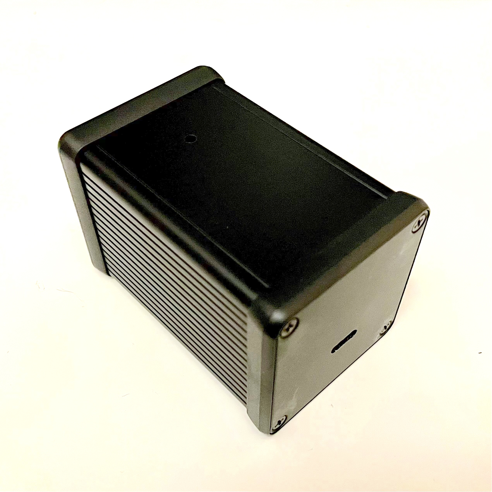
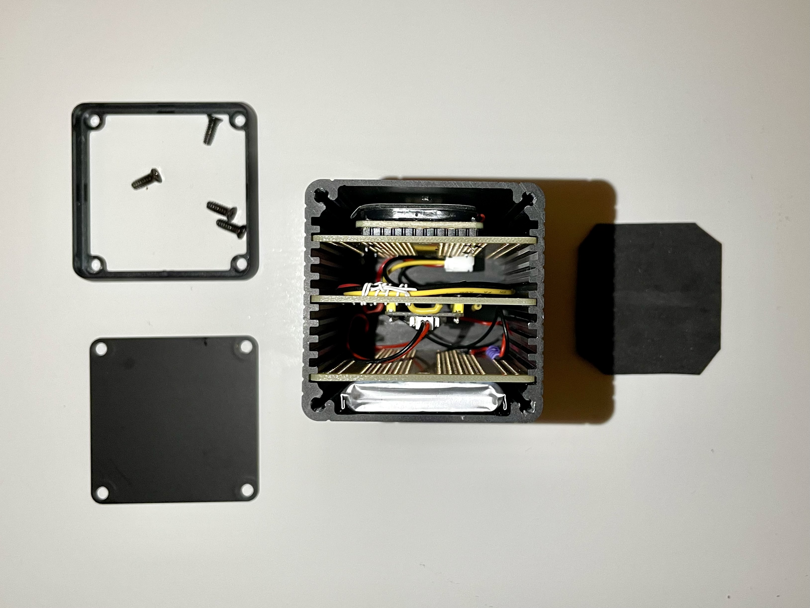

# NumberBox — Raspberry Pi Pico number speaker



A small RP2350 project that counts numbers and plays them using a basic "number
to speech" algorithm, with output via PWM audio.

This can be used to annoy your friends and loved ones, especially if you set up
the volume levels to be audible but indistinct.

## Components

The project uses the following components:

- [Waveshare RP2350 Plus (4MB + headers)](https://thepihut.com/products/waveshare-rp2350-plus?variant=53997063111041)
- [Adafruit Perma-Proto Half-sized Breadboard PCB 3 Pack](https://shop.pimoroni.com/products/adafruit-perma-proto-multipack?variant=281133558)
- [2000mAh 3.7V LiPo Battery](https://shop.pimoroni.com/products/lipo-battery-pack?variant=20429082247)
- [Adafruit STEMMA Speaker](https://shop.pimoroni.com/products/adafruit-stemma-speaker-plug-and-play-audio-amplifier?variant=30267266498643)
- [Hammond 1455CS801BK Enclosure](https://uk.farnell.com/hammond/1455cs801bk/enclosure-small-aluminium-black/dp/4380043)
- Assorted JST plugs and sockets purchased on eBay
  - JST-PH 2 pin through-hole solder plug for battery
  - Molex Picoblade 2 pin flylead to 2 pin socket
  - JST-PH 3 pin flylead to 3 pin socket
  - JST-PH 3 pin through-hold solder plug for audio

The combination of the Hammond enclosure and the half-sized Adafruit Perma-Proto
boards works especially well as the boards fit in the slots in the enclosure and
are the right dimensions to fit into the case comfortably.  I included a square
of 1mm EVA foam in the end to reduce rattling, which works well.

## The code

The repo includes a VSCode project that uses the
[pico-vscode](https://github.com/raspberrypi/pico-vscode) plugin to build the
project.  You can probably get things working just using CMake etc, but I found
the VSCode plugin to work pretty well, both for developing and programming the
controller.

The code uses the [pico-sdk](https://github.com/raspberrypi/pico-sdk) as well as
[pico-extras](https://github.com/raspberrypi/pico-extras) for the PCM audio
output.

```text
├── .vscode
├── audio
└── number_wavs
    ├── number_adpcm_files
    ├── number_mp3_files
    └── number_raw_files
```

The root of the project contains all of the source files and other build items.
I will cover this in more detail later.

The general approach taken is to break up a number, say 1,234,567 into numeric
tokens, eg `one`, `million`, `two`, `hundred`, `and`, `thirty`, `four`,
`thousand`, `five`, `hundred`, `and`, `sixty`, `seven`.  For each of the tokens,
there is sound data in a `.h` file in the `audio` directory, thirty-three files
in all, although zero is not actually used as the counting starts at one.

Tokenisation is British-English (`one`, `hundred`, `and`, `five`) rather than
American-English (`one`, `hundred`, `five`), although this would not be hard to
change.

### `number_wavs` directory

There are a number of Python scripts in this directory that generate and convert
audio fragments.

- ***gennums.py*** Uses the Python
  [gtts module](https://gtts.readthedocs.io/en/latest/module.html) to generate
  `mp3` files for each of the number fragments we need.  See the "Localized
  'accents'" section on that page if you would like an accent other than
  Australian.
- ***prepare-{adpcm,pcm}.py*** Scripts for converting the gtts mp3 files to IMA
  ADPCM or PCM respectively.  Note that both of these scripts require `sox`
  (probably `sox-ng`) to be installed to work.  Also other Python modules too,
  so take a look at the scripts.

The sub-directories are the gtts generated mp3 files, wav-encoded IMA ADPCM or
raw PCM files.  There is plenty of flash on the controller, so I just went ahead
and used raw PCM data in the end.

### Source overview

- ***`adpcm_decoder.{h,cpp}`*** A decoder for IMA ADPCM encoded data.  This is
  not used at present.
- ***`audio_player.{h,cpp}`*** Uses the specified `decoder` to play a list of
  `sample_data`.  Samples are overlapped and mixed by `OVERLAP_MS` milliseconds
  to give a somewhat more natural sounding readout.
- ***`audio.{h,cpp}`*** All of the audio data from the `audio` sub-directory is
  made available through the interface in `audio.h`.  `audio.cpp` just includes
  a heap of header files and some data definitions.
- ***`constants.h`*** Some runtime constants.  Probably the most interesting are
  `SILENCE_MS` the inter-number silence duration and `OVERLAP_MS` the degree of
  overlap/mix time between sound samples making up a single number readout.
- ***`fail.{h,cpp}`*** Confidence and failure flashes for the user LED available
  on most RP2350 controller boards.
- ***`number_to_speech.{h,cpp}`*** Tokenisation for numbers into speech element
  tokens.
- ***`pcm_decoder.h`*** Header only "decoder" for PCM data.  Just reassembles 16
  bit samples directly from bytes data.

There are some configuration options in the `CMakeLists.txt` file that can be
tweaked.  I have not, as yet, done a great job of working out which of these
should be in the `CMakeLists.txt` file, and which should be in `constants.h`,
so there is a random smattering in each.

Configuration from `CMakeLists.txt`:

- ***`AUDIO_SAMPLE_RATE`*** The audio rate of the samples.  Default 22058.
- ***`AUDIO_BUFFER_FORMAT`*** Audio sample format.  Default
  `AUDIO_BUFFER_FORMAT_PCM_S16`.
- ***`AUDIO_PWM_PIN`*** The pin the PWM audio will be output on.  Default 2.
- ***`AUDIO_BUFFER_SAMPLE_LENGTH`*** The size of each audio buffer in samples.
  Default 1024.
- ***`AUDIO_BUFFER_COUNT`*** How many audio buffers there are.  Default 3.

Configuration from `constants.h`:

- ***`SILENCE_MS`*** Silence time between numbers.  Default 300ms.
- ***`OVERLAP_MS`*** Overlap/mix time between adjacent samples.  Default 200ms.
- ***`USER_LED_PIN`*** The on-board LED pin for the controller.  Default 25.
- ***`WAVESHARE_MP28164_MODE_PIN`*** Pin that controls the mode of the MP28164.
- ***`PICO_FIRST_ADC_PIN`*** The first ADC pin.  For RP2350 this is 26.
- ***`PICO_VSYS_PIN`*** The ADC pin that the VSYS divider is connected to.
  Default 29.

`USER_LED_PIN` is used to flash the LED once on startup so you know the code has
started up.  If there are any errors detected during startup or runtime, the LED
will flash with a code showing the problem.  Failure codes are defined in
`fail.h`.

`WAVESHARE_MP28164_MODE_PIN` is used to control the mode of the
[MP28164](https://www.monolithicpower.com/en/mp28164.html) DC-DC converter on
the Waveshare controller.  Code can use this pin to switch between PSM (lower
power consumption, higher ripple) and PCM (higher power consumption, lower
ripple) modes.  Initially I was configuring the controller to be in PCM mode
during audio output, and then switch to PSM mode during the silence between
numbers.  By reducing clock speed and audio volume and optimising the code, I
managed to reduce the current draw to ~10ms.  This is low enough to permanently
run the converter in PSM mode without audible ripple, so the code to manipulate
the mode is commented out in `numbers_pwm.cpp`.

`PICO_FIRST_ADC_PIN` and `PICO_VSYS_PIN` can be used to measure the battery
voltage.  Initially I had plans to monitor the voltage and output some audible
warnings if it got too low.  This is yet to be implemented, but there is some
sample code commented out in `numbers_pwm.cpp` that could be used to implement
this idea.

### Build & flash

Create a build directory and configure the project:

```bash
mkdir build
cd build
cmake -G Ninja ..
```

Build with Ninja:

```bash
ninja
```

Flash the UF2 to the Pico (mass-storage method):

- Put the Pico in bootloader mode and copy `build/numbers_pwm.uf2` to the
  device.
- Or use `picotool` from the Pico SDK toolchain:

```bash
picotool load build/numbers_pwm.uf2 -fx
```

Alternatively, just use the VSCode Pico plugin and flash using USB or SWD as you
prefer.

## Hardware

The hardware is as simple as practical— I tried to use as few components as I
reasonably could.  Initially I had planned to have an RC filter, but the PWM
frequency and input stage on the amplifier made this unnecessary.



The above photo shows the arrangement of the components in the enclosure.  The
three boards are the excellent Adafruit Perma-Proto Half-sized Breadboard PCBs,
and they fit rather well in the Hammond enclosure.

From the bottom of the image, the boards / layers are:

- Battery and retaining board
- Controller module and board
- Amplifier module and board

The bottom board has a plug on the battery side.  On the top side, there is a
flylead to connect the battery to the charging circuit on the controller.  You
can just make out the purple lacing for the flylead on the right-hand side of
the enclosure, and the red/black wires plugging into a Molex Picoblade connector
on the controller.

The middle board has the controller, plus some additional wires to get power,
ground and PWM output to a 3-lead flylead on the opposite side of the board.
You can see the lacing towards the front of the board.

The USB-C socket on the controller board pokes out through a slot cut in the
opposite end-plate.  I drilled and filed the slot— it came out a bit rough.  If
I need to do this again, I will probably use a coping saw to drill and cut and
then use a file to finish, rather than use the file to remove significant
material.  You can see the slot in the overview at the start of this document.

The top board just has the speaker and amplifier.  The audio quality is not
great, but good enough for counting numbers.

## So far so good

The battery is charged through the USB-C connector on the controller.  Current
draw for the running unit is ~10mA, so I figure a fully charged 2000mAh battery
is good for a week, maybe a bit longer.  I haven't really tested this, but

The unit has been running for about 20 weeks now, and has counted up to
2,004,519.  Progress isn't linear as, for example, 1,999,999 takes quite a bit
longer to say than 2,000,000.
